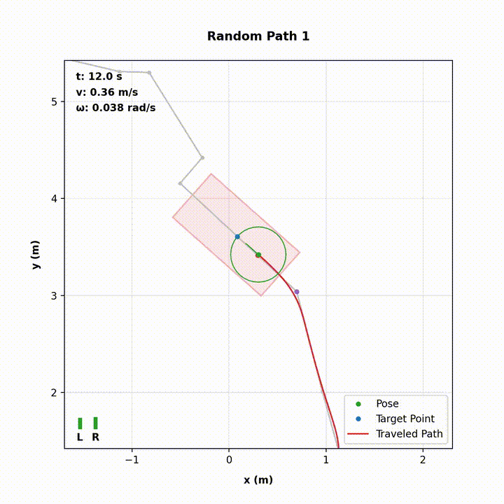
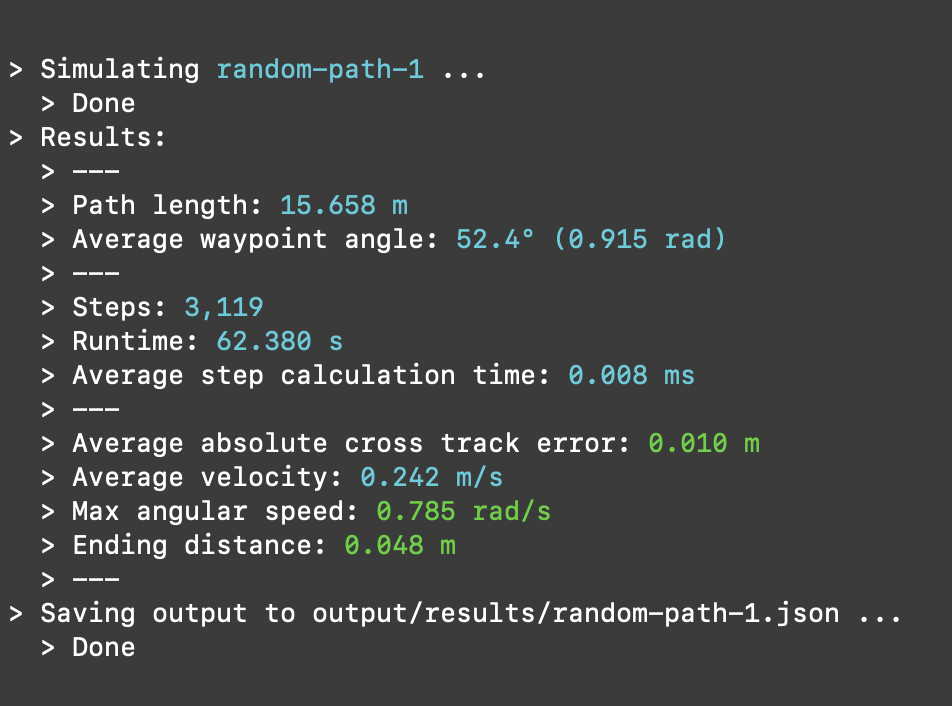
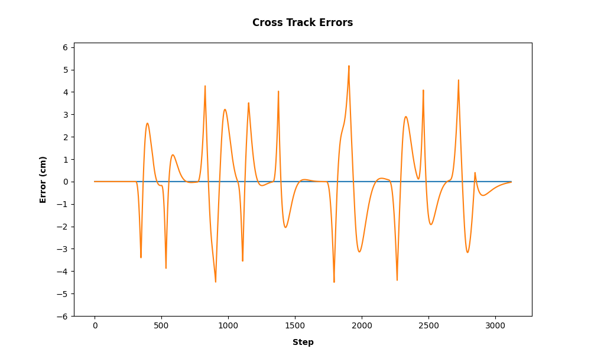

# Pure Pursuit
A pure pursuit implementation in python.  
  
Specifically, this is an implementation of an adaptive pure pursuit controller for diff drive path tracking, including animated simulation and cross track error reporting. The code is type-annotated for easy porting to other languages.



## Quickstart
Requires `python >= 3.12`
```
git clone git@github.com:christianbator/pure-pursuit.git
cd pure-pursuit

python3 -m venv .venv
source .venv/bin/activate

pip install .
pure-pursuit -p paths/random-path-1.json \
             -s config/simulation-config.json \
             -r config/robomower-config.json \
             -c config/pure-pursuit-config.json \
             --animate --follow --graphs
```

## Usage
You can run pure pursuit simulations with or without animations and the cross track error plot. Follow the instructions below to get started:

### Simulation
```
pure-pursuit -p paths/random-path-1.json \
             -s config/simulation-config.json \
             -r config/robomower-config.json \
             -c config/pure-pursuit-config.json
```  

Example simulation output:


**Cross Track Error**
The cross track error is defined as the absolute orthogonal distance from the path to the robot's point of rotation (mid-point of the axle). The red dot in the animation is called the "reference point", and it represents where the robot would be if the path tracking was perfect. The distance from the robot's point of rotation (mid-point of the axle) to the reference point is the _cross track error_.

You can view the cross track error by passing the `--graphs` argument:
```
pure-pursuit -p paths/random-path-1.json \
             -s config/simulation-config.json \
             -r config/robomower-config.json \
             -c config/pure-pursuit-config.json \
             --graphs
```

Example cross track error graph:


### Animation
You can view an animation of the simulation by passing the `--animate` argument. If you specify the optional `--follow` argument, the animation will center the robot's position and move along with it:
```
pure-pursuit -p paths/random-path-1.json \
             -s config/simulation-config.json \
             -r config/robomower-config.json \
             -c config/pure-pursuit-config.json \
             --animate --follow
```

To pause the animation, click anywhere in the animation window.


The animation shows a few things:
1. ...

**Saving Animations**
Prerequisites:
1. [ffmpeg](https://ffmpeg.org) (`brew install ffmpeg` or `sudo apt install ffmpeg`)

You can save the animation as an mp4 by passing the `--save-animation` argument (only works if `--animate` is also passed):
```
pure-pursuit -p paths/random-path-1.json \
             -s config/simulation-config.json \
             -r config/robomower-config.json \
             -c config/pure-pursuit-config.json \
             --animate --follow --save-animation
```  

This will use ffmpeg to write the animation to the `output/animations/` directory, and you'll see output like this:
```
> Saving animation to 'output/animations/random-path-1.mp4'...
  > Frame: 3118 / 3118
  > Done
```
Note: This won't display the animation, only save it to a file. This is useful after you've already run an interesting simulation and want to save it for later.

### Generating Paths
There are two helper scripts in `scripts/` to generate paths:
1. `generate_coverage_path.py`:
```
python3 scripts/generate_coverage_path.py [-h] -x MAX_X -y MAX_Y -o OUTPUT_DIR
```
This will generate a coverage path of a rectangular area defined by MAX_X and MAX_Y (think robotic lawn mower). Specify the max coordinates and output directory like so:
```
python3 scripts/generate_coverage_path.py -x 3 -y 4 -o paths
```

2. `generate_random_path.py`:
```
python3 scripts/generate_random_path.py [-h] -n NUM_PATHS -o OUTPUT_DIR
```
This will generate a random walk with varying distances between waypoints as well as potential intersections. Specify the number of random paths and output directory like so:
```
python3 scripts/generate_random_path.py -n 2 -o paths
```

### Building
If you make any changes, you can run the mypy analyzer to verify the type annotations with the build script in `build/`:
```
./build/build.sh
```

## Background
The original [pure pursuit](https://www.ri.cmu.edu/pub_files/pub3/coulter_r_craig_1992_1/coulter_r_craig_1992_1.pdf) controller was introduced by R. Craig Coulter in 1992, and many adaptive variants of it have been proposed throughout the years.  

...
